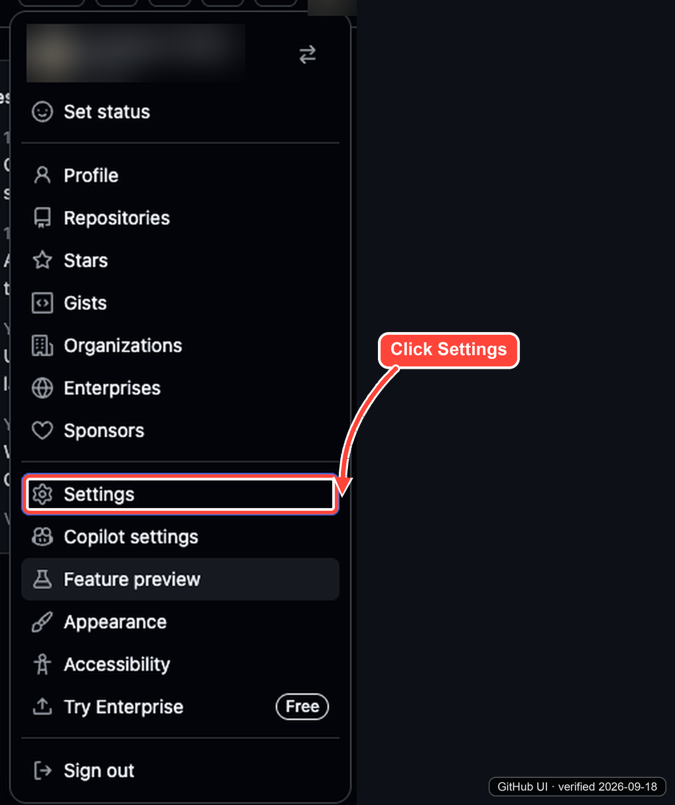
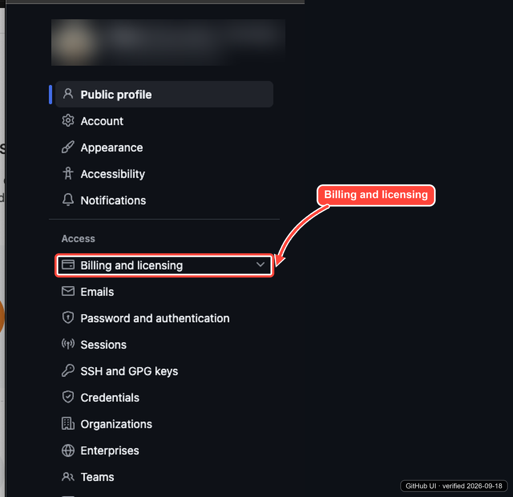
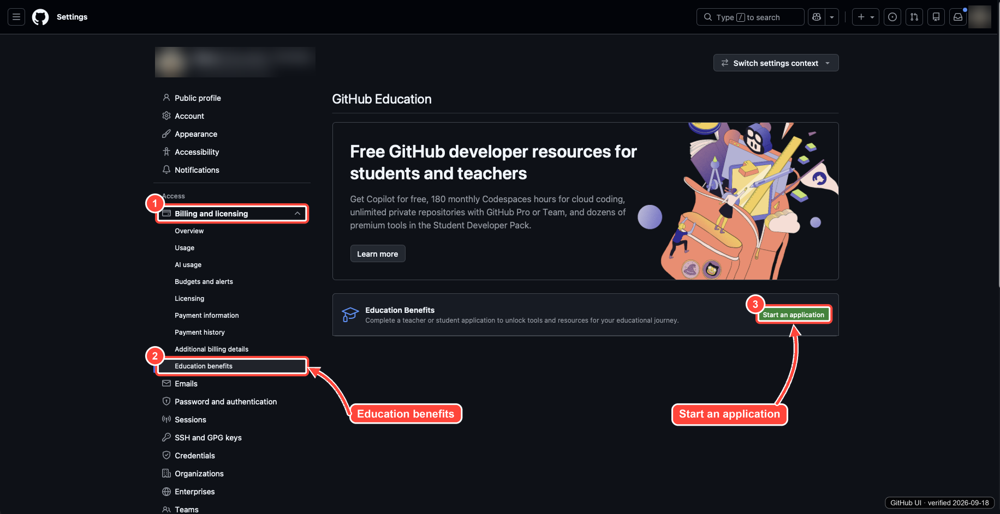
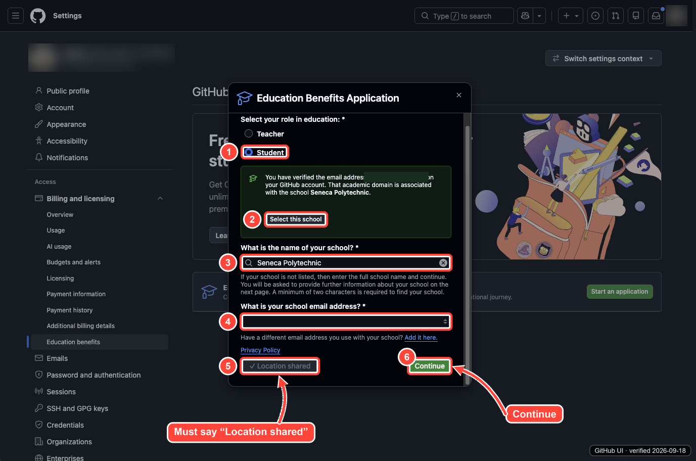
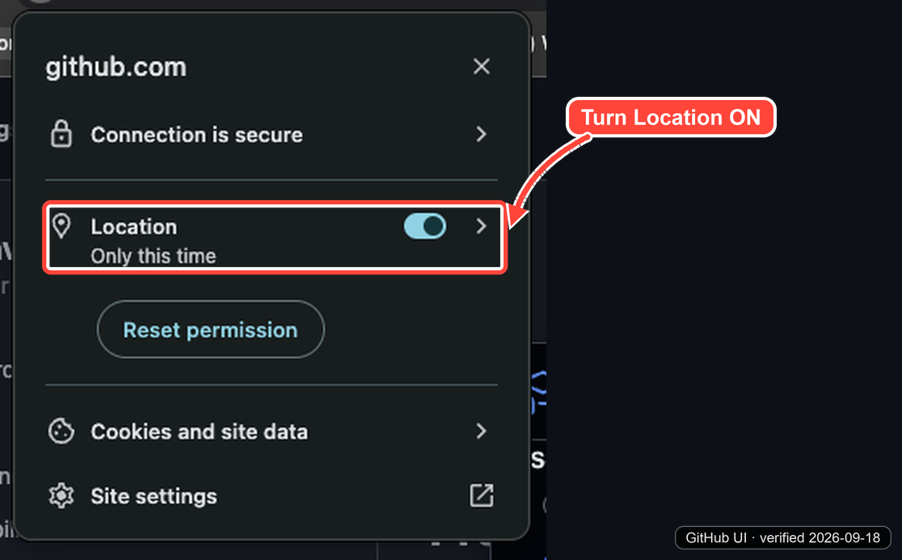
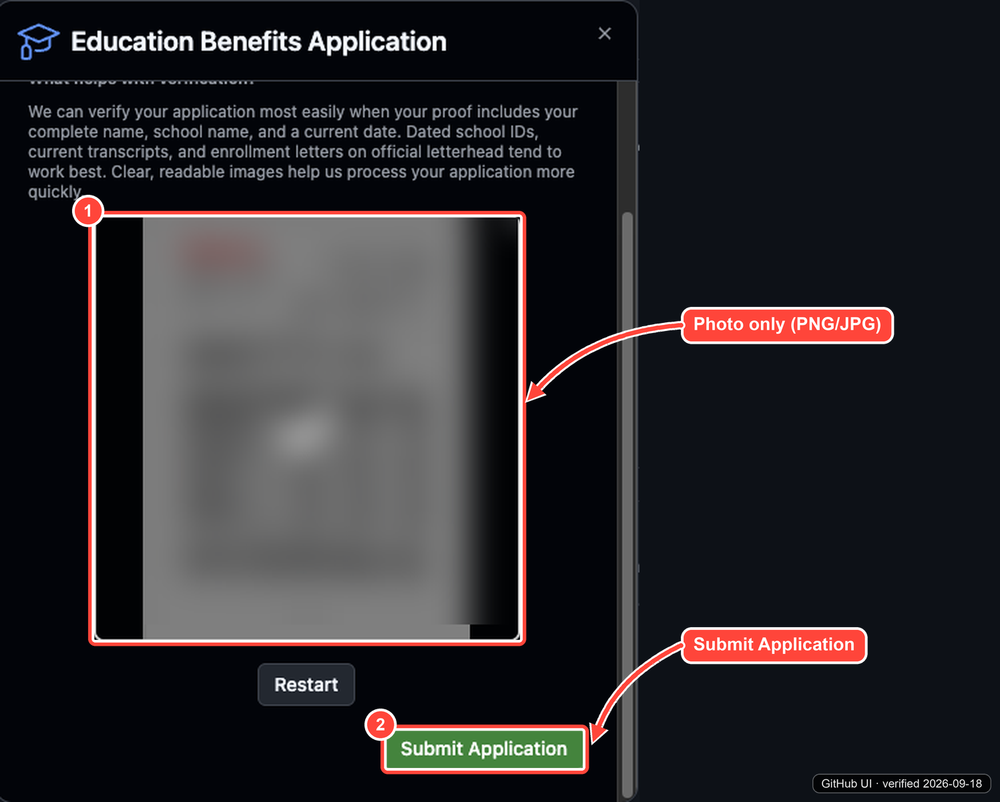
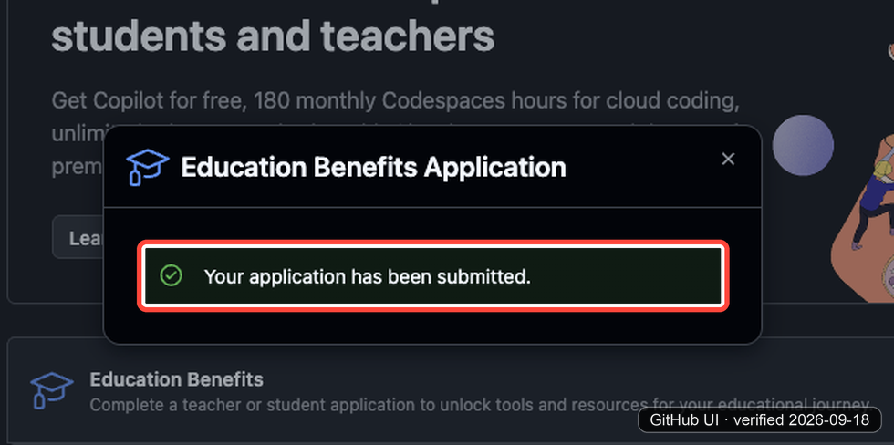
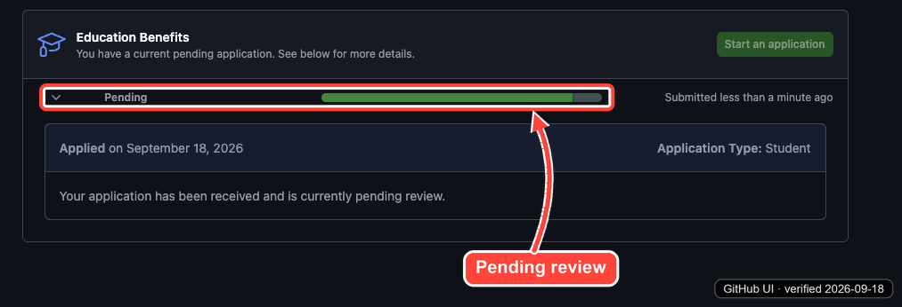
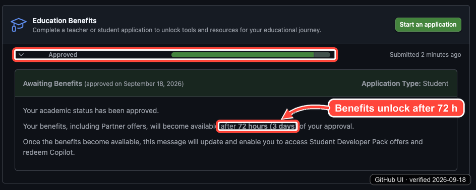

# How to claim the GitHub Student Developer Pack

> [!NOTE]
> **Last verified: 2026-09-18** on macOS (Safari and Chrome), GitHub in dark mode.
> Each screenshot carries a `GitHub UI · verified <date>` stamp in the bottom-right corner.
> Names, photos, and emails in the screenshots are blurred on purpose. You will see your own.
> GitHub changes its menus from time to time. If what you see does not match, jump to [Looks different?](#looks-different).

The GitHub Student Developer Pack is free for students. It includes GitHub Copilot, GitHub Pro, 180 Codespaces hours a month, and dozens of partner tools. It takes about 5 minutes to apply.

**Shortcut:** if you are already logged in, open <https://github.com/settings/education/benefits> and skip to [Step 3](#step-3-start-an-application).

## Before you start

- A GitHub account. Create one at <https://github.com/signup> if you do not have one.
- Your **@myseneca.ca** email added and verified on GitHub at <https://github.com/settings/emails>. This lets GitHub detect Seneca automatically in Step 4.
- A **photo** (PNG or JPG) of proof that you are a current student: a dated student ID card, a current transcript, or an enrollment letter or account statement. It must show your **full name**, **school name**, and a **current date**.
- A browser that is allowed to share your location.

> [!IMPORTANT]
> The upload only accepts **pictures (PNG or JPG)**. PDF and Word files are rejected. If your proof is a PDF, take a screenshot of it first.

## What to expect

| When | What happens |
| --- | --- |
| Day 0 | You apply. It takes about 5 minutes. |
| Minutes to a few days later | GitHub reviews your proof. The status shows **Pending**. |
| After review | The status changes to **Approved** (or denied, see [Troubleshooting](#troubleshooting)). |
| 72 hours after approval | Copilot, GitHub Pro, and the partner offers unlock. |

## Step 1: Open Settings

Log in to GitHub, click your **profile picture** in the top-right corner, then click **Settings**.

## Step 2: Open Billing and licensing

In the left sidebar, under **Access**, click **Billing and licensing** to expand it.

> [!NOTE]
> Don't worry about the word "Billing". GitHub just keeps the Education page in this menu. Applying is free, you will not be charged, and you do not need a credit card or any payment details.

## Step 3: Start an application

1. **Billing and licensing** is now expanded.
2. Click **Education benefits** at the bottom of that list.
3. On the right, click the green **Start an application** button.

## Step 4: Fill in the application

1. Select **Student**.
2. Click **Select this school**. This box only appears if your @myseneca.ca email is verified on GitHub.
3. Check that the school name says **Seneca Polytechnic**.
4. Pick your **@myseneca.ca** email.
5. Allow location. The button must say **Location shared** (see Step 5 if it does not).
6. Click **Continue**.

## Step 5: Allow location if it is blocked

GitHub checks that you are near your school. If the button does not say **Location shared**, turn location on for github.com, then reload the page and try again:

- **Chrome** (shown below): click the icon at the left of the address bar and turn **Location** on.
- **Safari**: go to **Safari > Settings > Websites > Location** and set github.com to **Allow**.

## Step 6: Upload your proof and submit

1. Take or upload a **photo** of your proof. Make sure your name, "Seneca", and a current date are readable.
2. Click **Submit Application**.

## Step 7: Wait for the result

You should see **Your application has been submitted**.

The Education benefits page then shows your application as **Pending**. Review can take anywhere from a few minutes to a few days.

Once approved, the status changes to **Approved**. Your benefits (Copilot, partner offers) **unlock 72 hours (3 days) after approval**, so do not worry if Copilot does not work right away.

After the 3 days, browse the partner offers at <https://education.github.com/pack>.

## Troubleshooting

| Problem | Fix |
| --- | --- |
| "Select this school" does not appear | Add and verify your @myseneca.ca email at <https://github.com/settings/emails>, then restart the application. |
| Location button is not "Location shared" | Allow location for github.com in your browser (Step 5), then reload. |
| Upload is rejected | Use a PNG or JPG photo, not a PDF or Word document. |
| Application is denied | Retake the photo so your full name, school, and a current date are clearly readable, then apply again. |
| Approved but Copilot is not active | Wait the full 72 hours after approval. |

## Looks different?

GitHub moves menu items around. If this guide no longer matches:

1. Go straight to <https://github.com/settings/education/benefits>. This link has stayed the same even when the menus change.
2. Check GitHub's official guide: [Apply to GitHub Education as a student](https://docs.github.com/en/education/about-github-education/github-education-for-students/apply-to-github-education-as-a-student).
3. [Report it](https://github.com/aws-seneca/info/issues/new?template=fix-or-update.yml) so we can update this guide.

## Changelog

| Date | Change |
| --- | --- |
| 2026-09-18 | First version. |

<!--
Maintainers: the screenshots are generated by annotate.py, which lives in the team
workspace next to the original screenshots (the originals contain personal data,
so they never go in this repo). To update: replace the originals, adjust the
coordinates in annotate.py, set VERIFIED to the new date, run it, then update the
date in the note at the top and add a changelog row.
-->
