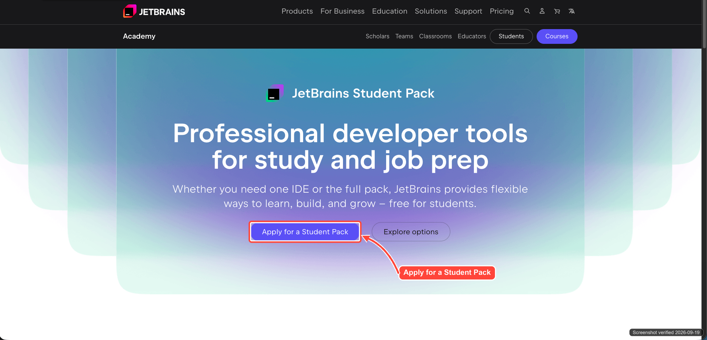
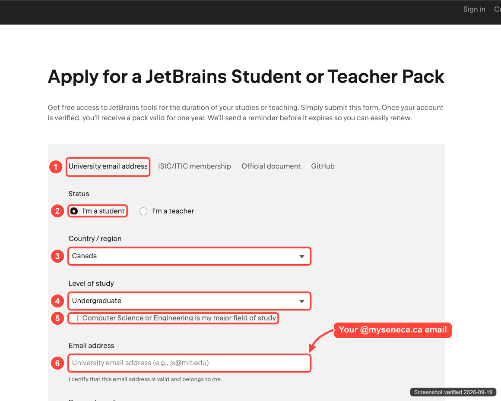
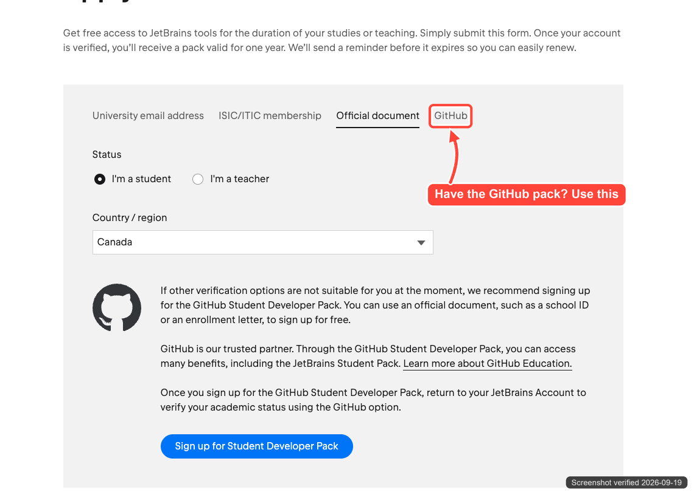
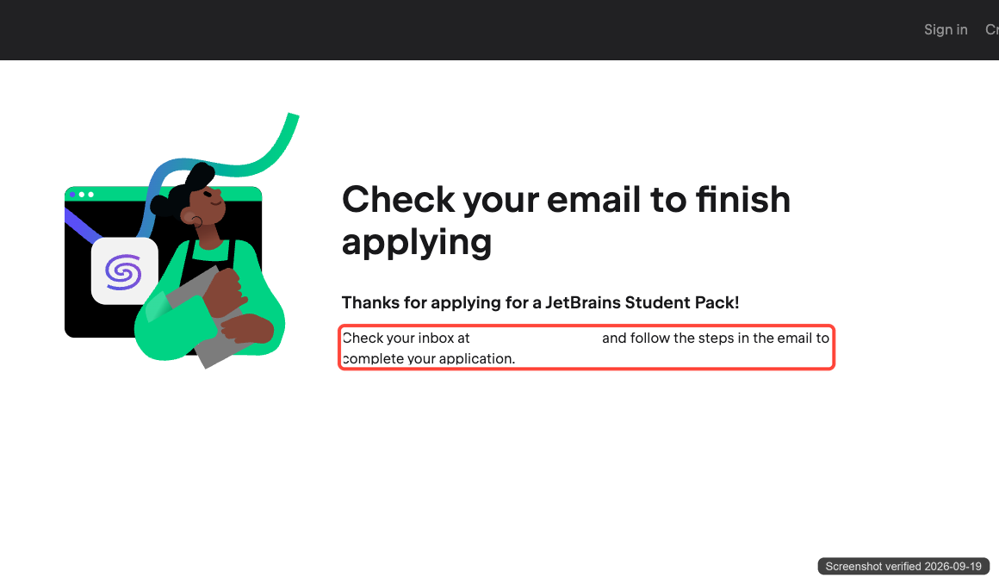
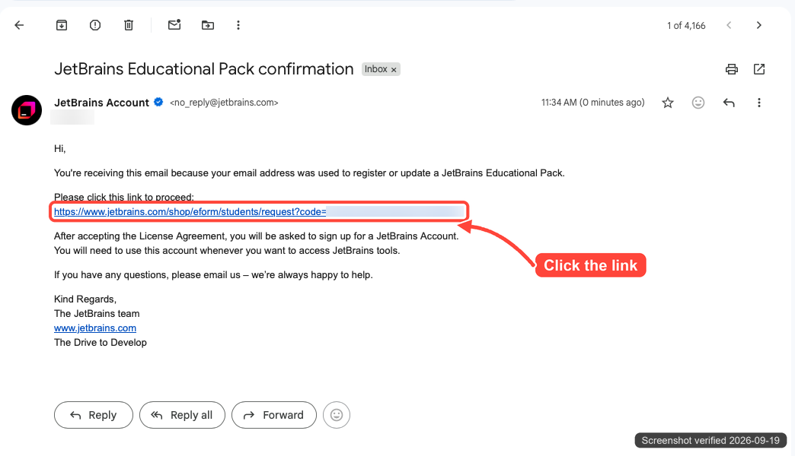
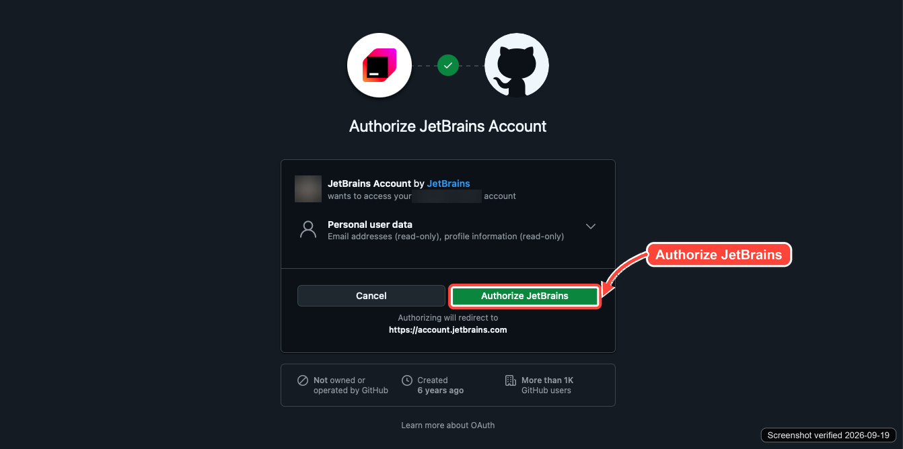
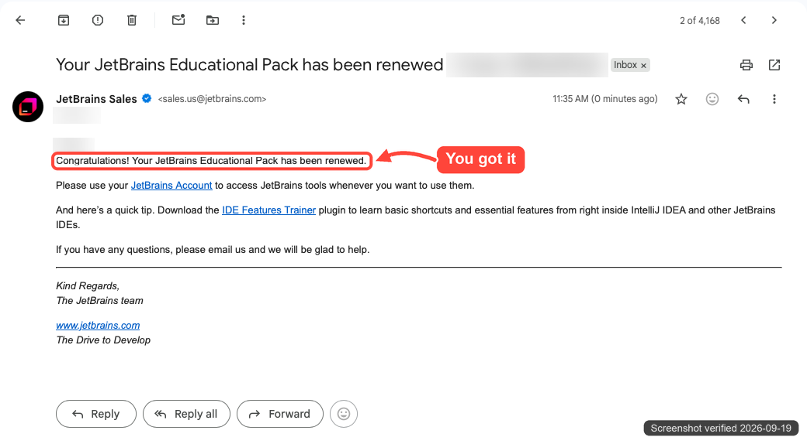
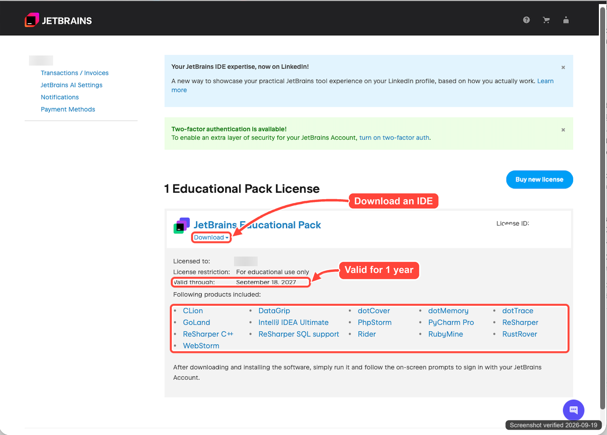

# How to claim the JetBrains Student Pack

> [!NOTE]
> **Last verified: 2026-09-19** on macOS (Chrome and Safari).
> Each screenshot carries a `Screenshot verified <date>` stamp in the bottom-right corner.
> Names, emails, and license numbers in the screenshots are blurred on purpose. You will see your own.
> JetBrains changes its pages from time to time. If what you see does not match, jump to [Looks different?](#looks-different).

The JetBrains Student Pack gives you every JetBrains coding app for free: IntelliJ IDEA Ultimate, PyCharm Pro, WebStorm, DataGrip, Rider, CLion, GoLand, and more. These normally cost hundreds of dollars a year. It takes about 5 minutes to claim.

## Before you start

You need **one** of these to prove you are a student:

- **Your @myseneca.ca email** (recommended). You can claim today.
- **An approved GitHub Student Developer Pack.** See the [GitHub Student Pack guide](../github-student-pack/). You can only use it after your GitHub benefits unlock, 72 hours after approval.

> [!NOTE]
> The license is free, but **for learning and school projects only**. Don't use it for paid or commercial work.

## What to expect

| When | What happens |
| --- | --- |
| Minute 0 | You fill in the form. |
| A minute later | JetBrains emails a confirmation link to your school email. |
| Right after you click it | You accept the agreement, log in, and get the license right away. |
| 1 year later | JetBrains emails you a reminder to renew. Renew every year while you are a student. |

## Step 1: Open the Student Pack page

Go to <https://www.jetbrains.com/academy/student-pack/> and click **Apply for a Student Pack**.

## Step 2: Fill in the form

1. Stay on the **University email address** tab.
2. Select **I'm a student**.
3. Choose **Canada** as your country.
4. Choose your **level of study** (for most Seneca programs, "Undergraduate").
5. Tick the box **only if** your program is Computer Science or Engineering. It's fine to leave it empty.
6. Enter your **@myseneca.ca** email.

Then scroll down, fill in your name, accept the terms, and click the apply button at the bottom of the form.

> [!TIP]
> **Already have the GitHub Student Pack?** Click the **GitHub** tab instead and follow the prompts. JetBrains checks your GitHub student status, so you skip the email steps.
>
> 

## Step 3: Check your school email

You will see **Check your email to finish applying**. Open your @myseneca.ca inbox (Outlook).

## Step 4: Click the link in the email

Open the email **JetBrains Educational Pack confirmation** and click the link. Check your junk folder if you don't see it.

## Step 5: Accept the agreement and log in

1. Accept the **License Agreement**.
2. Create a JetBrains account, or log in if you already have one.

The easiest way is to log in with GitHub. If you do, GitHub asks for permission. Click **Authorize JetBrains**. It only reads your email and profile.

## Step 6: Look for the success email

You will get an email from JetBrains Sales saying your Educational Pack is active. The screenshot says "renewed" because it was taken on an account that already had a license. Yours may say something slightly different.

## Step 7: Download your apps

Go to <https://account.jetbrains.com/licenses>. You should see **JetBrains Educational Pack**, the date it is valid until, and the list of included apps.

Click **Download** to get an app. Then open it and log in with your JetBrains account, and the license activates on its own.

> [!TIP]
> Install the free **JetBrains Toolbox App** from <https://www.jetbrains.com/toolbox-app/>. It installs and updates all JetBrains apps from one place.

## Make the most of it

- **IntelliJ IDEA Ultimate** for Java and Spring, **PyCharm Pro** for Python and data science, **WebStorm** for JavaScript and React, **DataGrip** for databases. Companies pay for these, so practicing with them now looks good on a résumé.
- Install the **IDE Features Trainer** plugin (JetBrains mentions it in the success email) to learn the shortcuts.
- After you graduate, JetBrains gives you a **40% discount** on a personal license.

## Troubleshooting

| Problem | Fix |
| --- | --- |
| No confirmation email | Check the junk folder of your @myseneca.ca inbox. Wait a few minutes, then apply again. |
| The GitHub tab says you are not verified | Your GitHub benefits unlock 72 hours after approval. Wait, or use the University email tab instead. |
| An app still asks for a license | Log in inside the app with the **same** JetBrains account that shows the license. |
| License expired | Apply again with the same steps. JetBrains renews it for another year while you are a student. |

## Looks different?

If this guide no longer matches:

1. Go straight to the form: <https://www.jetbrains.com/shop/eform/students>.
2. Check JetBrains' own help: [Free educational licenses FAQ](https://sales.jetbrains.com/hc/en-gb/categories/11557780144658-Free-educational-licenses-for-students-and-teachers).
3. Tell us so we can update this guide (see [the guides list](../)).

## Changelog

| Date | Change |
| --- | --- |
| 2026-09-19 | First version. |

<!--
Maintainers: the screenshots are generated by annotate.py, which lives in the team
workspace next to the original screenshots (the originals contain personal data,
so they never go in this repo). To update: replace the originals, adjust the
coordinates in annotate.py, set VERIFIED to the new date, run it, then update the
date in the note at the top and add a changelog row.
-->
