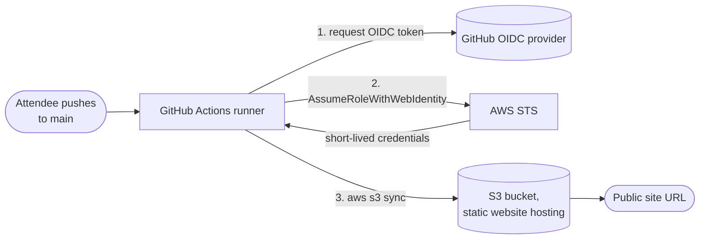
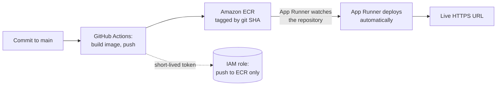

# CI/CD on AWS: research and technical design

Research for the CI/CD workshop, checked against AWS documentation on 2026-09-13. **None of this has been run yet.** It needs a timed dry run on a fresh AWS account and a fresh GitHub account before anyone teaches from it. Re-check pricing and GitHub Action versions the week of the event.

## Contents

- [Why the session deploys to S3](#why-the-session-deploys-to-s3)
- [Choosing a deploy target](#choosing-a-deploy-target)
- [Authenticate with OIDC, never with stored keys](#authenticate-with-oidc-never-with-stored-keys)
- [Architecture](#architecture)
- [The attendee's path](#the-attendees-path)
- [The GitHub Actions workflow](#the-github-actions-workflow)
- [The CloudFormation template](#the-cloudformation-template)
- [Known design problems](#known-design-problems)
- [Failure table for helpers](#failure-table-for-helpers)
- [Cost](#cost)
- [The follow-up: containers to production](#the-follow-up-containers-to-production)
- [Sources](#sources)

## Why the session deploys to S3

The time budget decides the target. A 45 to 60 minute slot with 20 minutes held back for helping people leaves 25 to 40 minutes of teaching.

**The pipeline is the whole lesson. Where it deploys to is incidental.** Attendees saw an S3 static site deployed by hand at the kickoff, so no time goes to explaining the destination. Every minute goes to the pipeline.

**The pattern is the same on any target.** A commit triggers a build, an artifact lands somewhere, something serves it. Swapping S3 for a container registry later changes the middle step and nothing else.

**Round-trip time decides it.** An `aws s3 sync` workflow finishes in well under a minute, so attendees can push three times and watch it land three times. Repetition inside one session is what makes it stick.

## Choosing a deploy target

Ordered by how much an attendee has to build before their first deploy.

| Target | Attendee effort | What the workflow does | Cost shape | Teaches |
|---|---|---|---|---|
| S3 static site | Lowest | `aws s3 sync` | Effectively free | The pipeline shape. No containers, no health checks |
| App Runner | Low | Build and push to ECR, nothing else | Per second of compute, no load balancer, can be paused | Containers, health checks, rolling deploys, HTTPS |
| ECS Express Mode | Medium | Build, push, update the service | Fargate plus a shared load balancer | The same, on the orchestrator used in industry |
| EC2 with Docker | Highest | Build, push, then reach into the instance | An always-on instance per attendee | Mostly how to configure a deploy agent |

**Why not EC2 with Docker.** Getting a new image onto a running instance means SSM Run Command, CodeDeploy with an agent, or an SSH key in GitHub Secrets. CodeDeploy needs the agent installed, an IAM user, instance registration, and a config file, per instance. For thirty attendees that is the most painful option. An SSH key in GitHub Secrets is the long-lived credential mistake in different clothes. You would also rebuild HTTPS, health checks, and rolling replacement by hand. EC2 belongs in the AWS 101 workshop, where it answers what a server is.

## Authenticate with OIDC, never with stored keys

Most tutorials generate an IAM access key and paste it into GitHub Secrets. It is the most common way a student project turns into a security incident.

With OIDC, GitHub hands the workflow a signed identity token, AWS STS swaps it for credentials that expire when the run ends, and no AWS key is stored anywhere.

IAM enforces scoping. When the GitHub OIDC provider is the trusted principal, IAM rejects a trust policy unless `token.actions.githubusercontent.com:sub` is present and is not only a wildcard. Scoping the role to one repository and one branch is required, not just good practice.

## Architecture



## The attendee's path

Five steps. The club makes steps 1 and 2 one click.

| # | Step | Where | Time |
|---|---|---|---|
| 1 | Fork the template repository | GitHub | 2 min |
| 2 | Launch the CloudFormation stack with their GitHub username and repository name | AWS Console, one-click URL | 3 min |
| 3 | Paste three stack outputs as repository secrets and variables | GitHub | 3 min |
| 4 | Edit one line, commit, push | GitHub web editor | 2 min |
| 5 | Watch the run, load the URL | Both tabs | 2 min |

Roughly 12 minutes of mechanics. Use the GitHub web editor for step 4. A local clone adds git setup, credentials, and editor problems to a session with no slack.

Template repository layout:

```
site/index.html               the one heading attendees edit, and the only thing synced
.github/workflows/deploy.yml
README.md                     the five steps, so nobody depends on remembering the slides
```

Sync `site/`, not the repository root. Syncing the root would publish `.github/` and `README.md` to a public bucket.

## The GitHub Actions workflow

```yaml
name: Deploy

on:
  push:
    branches: [main]

permissions:
  id-token: write   # lets this job request an OIDC token. Grants nothing else
  contents: read    # lets it check out the code

jobs:
  deploy:
    runs-on: ubuntu-latest
    steps:
      - uses: actions/checkout@v4

      - uses: aws-actions/configure-aws-credentials@v4
        with:
          role-to-assume: ${{ secrets.AWS_ROLE_ARN }}
          aws-region: ${{ vars.AWS_REGION }}

      - name: Publish
        run: aws s3 sync ./site "s3://${{ vars.BUCKET_NAME }}" --delete
```

Two lines worth a slide each:

- **`id-token: write`** is the line everyone misreads. It sounds like write access to something. It only lets the job request an identity token.
- **`--delete`** makes the bucket mirror the folder, so a file deleted in git disappears from the site.

## The CloudFormation template

The club builds this once. Each attendee launches their own stack, scoped to their own repository.

```yaml
AWSTemplateFormatVersion: '2010-09-09'
Description: Workshop stack. Public S3 site plus a GitHub OIDC deploy role.

Parameters:
  GitHubOwner:
    Type: String
    Description: Your GitHub username or org
  GitHubRepo:
    Type: String
    Description: Repository name, without the owner
  CreateOIDCProvider:
    Type: String
    AllowedValues: ['yes', 'no']
    Default: 'yes'
    Description: Choose no if this account already has a GitHub OIDC provider

Conditions:
  MakeProvider: !Equals [!Ref CreateOIDCProvider, 'yes']

Resources:

  GitHubOIDCProvider:
    Type: AWS::IAM::OIDCProvider
    Condition: MakeProvider
    Properties:
      Url: https://token.actions.githubusercontent.com
      ClientIdList: [sts.amazonaws.com]
      # ThumbprintList omitted on purpose. It is optional, and IAM retrieves
      # and uses the provider's intermediate CA thumbprint when it is absent.

  SiteBucket:
    Type: AWS::S3::Bucket
    Properties:
      BucketName: !Sub '${AWS::StackName}-${AWS::AccountId}'
      WebsiteConfiguration:
        IndexDocument: index.html
        ErrorDocument: index.html
      PublicAccessBlockConfiguration:
        BlockPublicAcls: true
        IgnorePublicAcls: true
        BlockPublicPolicy: false
        RestrictPublicBuckets: false
      OwnershipControls:
        Rules:
          - ObjectOwnership: BucketOwnerEnforced

  SiteBucketPolicy:
    Type: AWS::S3::BucketPolicy
    Properties:
      Bucket: !Ref SiteBucket
      PolicyDocument:
        Version: '2012-10-17'
        Statement:
          - Effect: Allow
            Principal: '*'
            Action: s3:GetObject
            Resource: !Sub '${SiteBucket.Arn}/*'

  GitHubActionsRole:
    Type: AWS::IAM::Role
    Properties:
      AssumeRolePolicyDocument:
        Version: '2012-10-17'
        Statement:
          - Effect: Allow
            Principal:
              Federated: !Sub 'arn:${AWS::Partition}:iam::${AWS::AccountId}:oidc-provider/token.actions.githubusercontent.com'
            Action: sts:AssumeRoleWithWebIdentity
            Condition:
              StringEquals:
                token.actions.githubusercontent.com:aud: sts.amazonaws.com
                token.actions.githubusercontent.com:sub: !Sub 'repo:${GitHubOwner}/${GitHubRepo}:ref:refs/heads/main'
      Policies:
        - PolicyName: publish-to-one-bucket
          PolicyDocument:
            Version: '2012-10-17'
            Statement:
              - Effect: Allow
                Action: s3:ListBucket
                Resource: !GetAtt SiteBucket.Arn
              - Effect: Allow
                Action:
                  - s3:PutObject
                  - s3:DeleteObject
                Resource: !Sub '${SiteBucket.Arn}/*'

Outputs:
  RoleArn:
    Description: Paste as repository secret AWS_ROLE_ARN
    Value: !GetAtt GitHubActionsRole.Arn
  BucketName:
    Description: Paste as repository variable BUCKET_NAME
    Value: !Ref SiteBucket
  Region:
    Description: Paste as repository variable AWS_REGION
    Value: !Ref AWS::Region
  SiteUrl:
    Description: Your live site
    Value: !GetAtt SiteBucket.WebsiteURL
```

Three things to say out loud rather than skip:

- **The bucket is public.** That is right for a static site and wrong almost everywhere else. `BlockPublicAcls` and `IgnorePublicAcls` stay on, and `BucketOwnerEnforced` disables ACLs, so the bucket policy is the only way in.
- **No padlock.** S3 website endpoints serve HTTP. HTTPS needs CloudFront, which takes too long to create for this session.
- **The role can touch one bucket and nothing else.** That least-privilege scope is the point of the design.

## Known design problems

**The OIDC provider collision.** An account can have only one GitHub OIDC provider. Anyone who has done this before, or runs the stack twice, gets a create failure. The `CreateOIDCProvider` parameter makes attendees know which case they are in. Alternatives considered: a separate bootstrap stack (adds a step), or a Lambda custom resource that checks first (too much for a beginner session). Suggestions welcome.

**Bucket names.** `${AWS::StackName}-${AWS::AccountId}` is unique in practice because the account ID is in it.

**Account restrictions.** Sandbox accounts, such as AWS Academy Learner Lab, may block creating IAM OIDC providers. Confirm before choosing that route.

## Failure table for helpers

In rough order of how often each is expected. Print it.

| Symptom | Cause | Fix |
|---|---|---|
| `Not authorized to perform sts:AssumeRoleWithWebIdentity` | The `sub` condition does not match. Usually a branch other than `main`, or a typo in the username at stack launch | Check the branch, then the stack parameter |
| `Credentials could not be loaded` | `permissions: id-token: write` missing or edited out | Restore it |
| Workflow is green, site unchanged | Browser cache, or they edited a file outside `site/` | Hard refresh, then check the path |
| `AccessDenied` on `s3 sync` | Wrong bucket name pasted, or the policy covers the bucket but not its objects | Compare the variable with the stack output |
| Site returns 403 | The bucket policy did not attach, or public access block is still on | Check the stack finished, not just started |
| Stack create fails on the OIDC provider | The account already has one | Relaunch with `CreateOIDCProvider: no` |
| Stack delete fails | The bucket still has objects | Empty the bucket, then retry |
| No padlock in the address bar | Expected. S3 website endpoints serve HTTP | Explain, do not fix |

Beginners do not raise their hands. They stop clicking and quietly decide the club is not for them. A helper's job is to notice the stopped clicking and walk over.

## Cost

**Effectively zero.** A bucket holding a few kilobytes with a handful of requests stays inside the always-free allowances. No compute, no load balancer, nothing billed by the hour.

Delete the stack at the end anyway. It takes two minutes and builds the habit before the container session, where it matters.

## The follow-up: containers to production

If the club wants to go all the way from commit to a running container, that is two 90-minute sessions, not one. The pipeline fails at YAML and permissions. The runtime fails at networking and health checks. Compressing both into one slot loses the room halfway.

**Recommended target: App Runner.** It watches a private ECR repository in the same account and deploys every new image on its own, so the workflow only builds and pushes. It gives HTTPS, auto scaling, health checks, and rolling deploys with no load balancer to configure, and a service can be paused. Automatic deployment must be turned on, and it does not work with public ECR or ECR in another account.



**The step up: ECS Express Mode**, announced November 2025 at no extra charge. From one image it creates a Fargate cluster, task definition, service with canary deploys, load balancer with HTTPS, certificate, log group, and deployment alarms. Up to 25 services share one load balancer. Worth demonstrating even if nobody builds it.

**Session 1: container to production, by hand.** What a container is, write a Dockerfile, push to ECR, create the App Runner service, then a gated teardown with a billing alarm. Doing it by hand first is what makes automation feel like relief.

**Session 2: the pipeline, and what production means.** Launch a CloudFormation stack, read the workflow together, push and watch it deploy, ship a container that fails its health check and watch the old version keep serving, then five production habits:

1. Never deploy `latest`. Tag every image with its git SHA.
2. A deploy is done when the new version passes its health check and takes traffic, not when the pipeline turns green.
3. Plan the rollback before you need it. Redeploy the previous SHA, live.
4. Keep secrets out of the image and the repository. Read them at runtime from SSM Parameter Store or Secrets Manager. A secret baked into an image layer stays there even if a later layer deletes it.
5. Production should not be the first place a change runs. GitHub Environments with a required reviewer is the cheapest gated promotion.

**Cost.** App Runner publishes $0.064 per vCPU-hour of active compute and $0.007 per GB-hour of provisioned memory. For thirty attendees on 1 vCPU and 2 GB over 90 minutes, that estimates to roughly three to four dollars for the room. Confirm with the AWS Pricing Calculator before publishing. The real risk is attendees who do not tear down and slowly burn their free plan credits, so teardown is a gate, a billing alarm is a required step, and someone runs a cleanup the next day.

## Sources

- [Create a role for OpenID Connect federation](https://docs.aws.amazon.com/IAM/latest/UserGuide/id_roles_create_for-idp_oidc.html)
- [IAM and AWS STS condition context keys](https://docs.aws.amazon.com/IAM/latest/UserGuide/reference_policies_iam-condition-keys.html)
- [CfnOIDCProvider thumbprintList](https://docs.aws.amazon.com/cdk/api/v2/docs/aws-cdk-lib.aws_iam.CfnOIDCProvider.html)
- [AWS App Runner pricing](https://aws.amazon.com/apprunner/pricing/)
- [Deploying a new application version to App Runner](https://docs.aws.amazon.com/apprunner/latest/dg/manage-deploy.html)
- [AWS::AppRunner::Service](https://docs.aws.amazon.com/AWSCloudFormation/latest/TemplateReference/aws-resource-apprunner-service.md)
- [Tutorial: use CodeDeploy to deploy an application from GitHub](https://docs.aws.amazon.com/codedeploy/latest/userguide/tutorials-github.html)
- [Announcing Amazon ECS Express Mode](https://aws.amazon.com/about-aws/whats-new/2025/11/announcing-amazon-ecs-express-mode/)
- [Resources created by Amazon ECS Express Mode services](https://docs.aws.amazon.com/AmazonECS/latest/developerguide/express-service-work.html)
- [Automated deployments with GitHub Actions for Amazon ECS Express Mode](https://aws.amazon.com/blogs/containers/automated-deployments-with-github-actions-for-amazon-ecs-express-mode/)
- [Amazon ECS FAQs](https://aws.amazon.com/ecs/faqs/)
